# 🔐 VaultLLM

### Local multi-model AI with cryptographically verifiable data sovereignty

**Hacktober Fest 2026 · Open Source AI Hackathon · Organized by Elevate** 🏆  
**Challenge Track:** Best Open-Source AI Project  
**Repository:** https://github.com/GURU-2006-PRO/VaultLLM  

> **Qualifier Note:** This repository contains the complete technical specification. Implementation will be completed during the final hackathon on October 10, 2026.

---

## 📌 At a Glance

- **What:** A fully local AI workspace (chat, document Q&A, agent tools) that runs open-weight models on Ollama and produces **signed, independently verifiable proof of what left the machine**.

- **Why it's different:** Most "private AI" tools only *claim* privacy. VaultLLM **enforces** it (Docker network isolation), **observes** it (hash-chained audit log), and **attests** it (Ed25519-signed certificates that anyone can verify).

- **Open-source AI used:** Ollama runtime, 13+ open-weight LLMs (up to 30B on DGX B200), embedding models for intelligent routing, local vector database, and tool-calling agents.

- **Key innovation:** Hash-chained tamper-evident audit log + Ed25519 cryptographic signatures + active egress canary + independent browser-based verifier = **verifiable privacy, not just promises**.

- **Demo-ready:** Red-team demonstration where an external request is attempted, caught, logged, and the certificate instantly flips from ✅ VERIFIED to ❌ VIOLATED.

---

## 1. 📋 Project Name

**VaultLLM: Enterprise-Grade Multi-Model AI System with Cryptographically Verifiable Data Sovereignty** 🛡️

---

## 2. ⚠️ Problem Statement

### The Privacy Crisis in Modern AI 🚨

Organizations handling sensitive data (clinical notes, legal contracts, proprietary code, financial models, internal reports) need LLM productivity but **cannot send data to third-party APIs**.

Running models locally seems like the obvious answer, but it leaves **three critical problems unsolved:**

| Problem | Impact | Current Gap |
|---------|--------|-------------|
| **No Proof** 💔 | "It runs locally" is just a claim. Compliance officers, auditors, and clients cannot verify it. Local apps often still call telemetry, update, or plugin endpoints. | No verifiable evidence |
| **No Enforcement** 🔒 | Application-level promises don't prevent dependencies from opening outbound connections. A single npm package can leak data. | No technical guarantee |
| **No Structure** 🤔 | Local tools are usually one model behind a chat box. Teams need the right model per task, document grounding, and extensibility. | Single-model limitation |

**The fundamental gap:** There is no lightweight, open-source tool that combines **local multi-model AI** with **enforced isolation** and **independently verifiable proof** of that isolation.

### Real-World Impact Examples 🌍

| Sector | Risk | Regulation Violated |
|--------|------|---------------------|
| **Healthcare** 🏥 | Patient data transmitted to cloud AI providers | HIPAA, patient privacy rights |
| **Legal Services** ⚖️ | Attorney-client privilege compromised | Professional confidentiality rules |
| **Financial Institutions** 💰 | Trading algorithms exposed to third parties | SOC 2, proprietary strategy protection |
| **Enterprise R&D** 🔬 | Source code analyzed through external APIs | IP theft risk, trade secret laws |
| **Government Agencies** 🏛️ | Classified documents processed externally | Data localization requirements |

---

## 3. 💡 Project Overview

VaultLLM is a self-hosted AI workspace built around one principle: **privacy should be a verifiable property of the system, not a promise.**

### Three Core Pillars

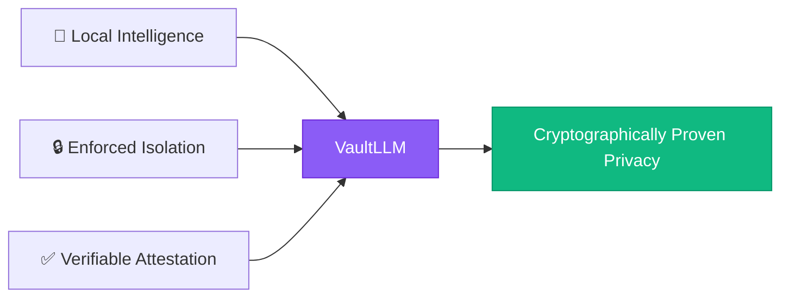

| Pillar | What It Does | Technology |
|--------|--------------|------------|
| **🧠 Local Intelligence** | Runs open-weight LLMs and embedding models through Ollama. Embedding-based router selects the best model per request. Tool-calling agent answers questions over private documents. | Ollama + 13+ models + semantic routing + RAG |
| **🔒 Enforced Isolation** | Two explicit modes: **Setup** (allows model downloads) and **Sealed** (Docker network with zero internet access). Plus egress canary actively testing blocks. | Docker Compose + internal network + active canary |
| **✅ Verifiable Attestation** | Hash-chained tamper-evident audit log + Ed25519 signatures + independent verifier that recomputes everything client-side. | Cryptographic proof, not trust |

### Not Just Another Chatbot 🤖

VaultLLM is **engineered infrastructure**, not a simple chat interface:

- ✅ Model registry with hot-reload manifests
- ✅ Intelligent semantic routing across specialized models
- ✅ Agent orchestrator with tool-calling
- ✅ Document RAG with citations
- ✅ Hash-chained audit log (tamper-evident)
- ✅ Ed25519 cryptographic signatures
- ✅ Independent browser-based verifier
- ✅ Red-team demo proving isolation
- ✅ DGX B200 support for 30B models

---

## 4. ✅ Proposed Solution

### Architecture Overview

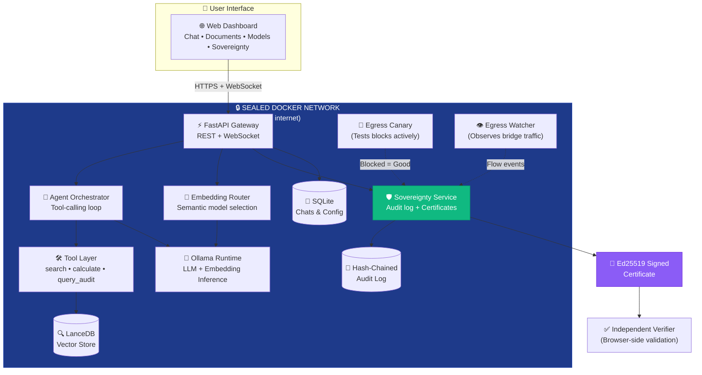

### Operating Modes

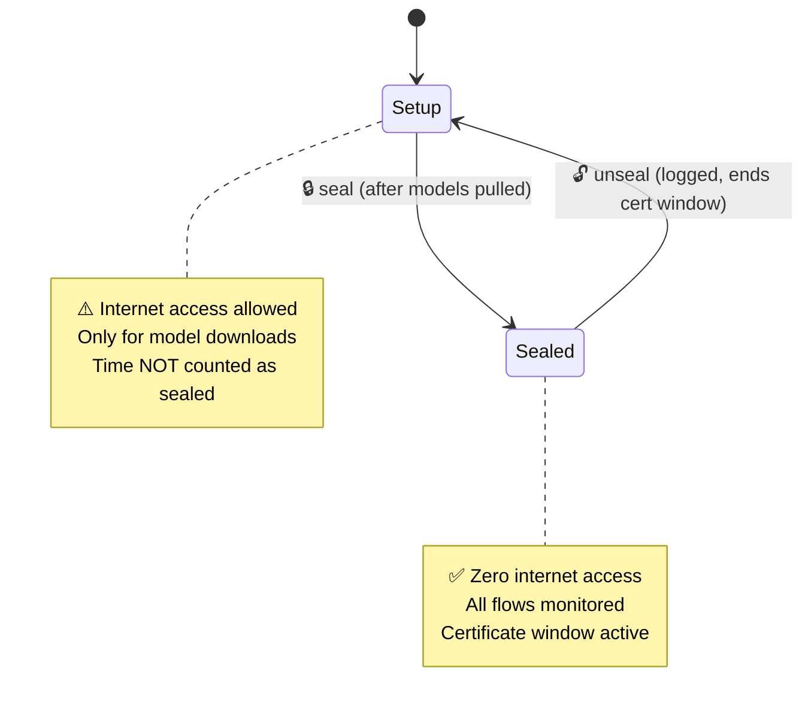

### Solution Components

| Component | Implementation | Verification |
|-----------|----------------|--------------|
| **Network Isolation** | Docker internal network with no external routes | Egress canary proves blocks work |
| **Flow Observation** | Egress watcher sidecar + Python audit hooks | All flows logged with timestamps |
| **Tamper Evidence** | Hash-chained log: `hash_i = SHA-256(entry_i + hash_{i-1})` | Editing any entry breaks all subsequent hashes |
| **Cryptographic Proof** | Ed25519 signatures over certificate | Independent verifier recomputes and validates |
| **Intelligent Routing** | Embedding-based semantic model selection | Best model per task automatically |
| **Document Grounding** | Local RAG: chunk → embed → retrieve → cite | Private document Q&A with source references |

---

## 5. 🎯 Objectives

### Primary Objectives 🥇

| Objective | Measurable Success Criteria | Verification Method |
|-----------|----------------------------|---------------------|
| **Data Sovereignty Guarantee** 🔐 | Zero external connections in sealed mode | Certificate shows 0 external flows |
| **Cryptographic Verification** ✅ | Independent validation without trusting backend | Verifier page validates in browser |
| **Multi-Model Intelligence** 🧠 | Automatic routing across specialized models | Router confidence scores logged |
| **Production-Ready** ⚡ | One-command start, stable for 8+ hours | Docker Compose up + demo |
| **Enterprise Compliance** 📋 | GDPR/HIPAA audit-ready evidence | Downloadable signed certificates |

### Secondary Objectives 🥈

- **User Experience** 🎨: Intuitive dashboard with real-time sovereignty status
- **Operational Transparency** 👁️: Live flow monitoring and routing decisions visible
- **Cost Elimination** 💸: Zero API costs after setup, no subscriptions
- **Offline Capability** 📴: Full functionality without internet (air-gap ready)
- **Future-Proof** 🔮: Manifest-based extensibility for new models
- **DGX B200 Optimization** 🚀: Support for models up to 30B parameters

---

## 6. 👥 Target Users / Use Cases

| User | Need | How VaultLLM Helps | Evidence Provided |
|------|------|-------------------|-------------------|
| **Healthcare Organizations** 🏥 | AI-assisted diagnosis without HIPAA violations | Sealed mode + RAG over patient records | Certificate for Joint Commission audits |
| **Legal Firms** ⚖️ | Document analysis preserving attorney-client privilege | Local processing + cited answers | Audit log for e-discovery compliance |
| **Financial Institutions** 💰 | Proprietary strategy analysis without leaks | Network isolation + audit trail | SOC 2 compliance evidence |
| **Enterprise R&D** 💻 | Code analysis protecting IP | Local inference + sovereignty proof | Security audit documentation |
| **Government Agencies** 🏛️ | Classified document processing | Air-gap ready + tamper-evident logs | Data localization compliance proof |
| **Compliance Officers** 📊 | Verify privacy claims technically | Independent verifier + chain validation | Third-party auditable certificates |
| **Developers & Researchers** 🔬 | Private experimentation with open models | Manifest system + model flexibility | Academic integrity assurance |

### Primary Demo Use Case 🎬

**Compliance audit scenario:**
1. User uploads sensitive documents (medical records, contracts, source code)
2. Asks questions, gets cited answers from multiple specialized models
3. Downloads Ed25519-signed certificate proving zero external connections
4. Auditor independently verifies certificate in browser
5. **Red-team test:** External request attempted → blocked → logged → certificate flips to VIOLATED
6. **Tamper test:** Edit audit log → verifier detects broken hash chain

---

## 7. 🤖 Open-Source AI Technology Selected

### Model Portfolio 🎭

| Category | Models | Parameters | Purpose | License |
|----------|--------|------------|---------|---------|
| **General Purpose** 🌐 | llama3.2, mistral, gemma2 | 1-7B | Reasoning, conversation | Meta Llama, Apache 2.0, Gemma Terms |
| **Code Specialized** 💻 | qwen2.5-coder, deepseek-coder, codellama | 1.5-7B | Code generation, analysis | Qwen, DeepSeek, Meta Llama |
| **Vision-Language** 👁️ | llava, qwen2.5vl | 3-7B | Image understanding, multimodal | Apache 2.0, Qwen |
| **Reasoning** 🧮 | phi3 | 3.8B | Logic, mathematical tasks | MIT |
| **Embeddings** 📊 | nomic-embed-text | 137M | Semantic search, routing | Apache 2.0 |
| **Large Models** 🚀 | llama3.1 70B, qwen2.5 32B, mixtral 8x7B | 30-70B | Complex reasoning (DGX B200) | Various open licenses |

**Total:** 13+ pre-configured models, extensible via JSON manifests

### Core Infrastructure

| Component | Technology | Version | License | Purpose |
|-----------|-----------|---------|---------|---------|
| **LLM Runtime** | Ollama | Latest | MIT | Local inference, streaming, tool-calling |
| **Vector Database** | LanceDB | Latest | Apache 2.0 | Embeddings storage and similarity search |
| **Relational DB** | SQLite | 3.x | Public Domain | Conversations, config, metadata |
| **API Framework** | FastAPI + Uvicorn | 0.100+ | MIT | REST + WebSocket gateway |
| **Isolation** | Docker + Compose | 24+ | Apache 2.0 | Network isolation, sealed mode |
| **Cryptography** | Python `cryptography` | 41+ | Apache 2.0 / BSD | Ed25519 signatures, SHA-256 hashing |
| **Egress Monitoring** | tcpdump / libpcap | Latest | BSD-3-Clause | Network flow observation |
| **Document Parsing** | pypdf, Markdown parsers | Latest | BSD / MIT | PDF and text extraction |
| **Frontend** | HTMX + minimal JS | Latest | BSD-2 | Lightweight reactive dashboard |

### GPU Infrastructure 💪

**NVIDIA DGX B200 Configuration:**
- **Architecture:** Blackwell B200 GPUs
- **VRAM:** Up to 192GB per GPU
- **Model Support:** Up to 30B parameter models with full precision
- **Throughput:** High concurrent inference for multiple users
- **Optimization:** CUDA 12+ optimized, model quantization support

---

## 8. 🔍 Why This Technology Was Selected

### Why Open-Source AI? ✨

The entire value proposition depends on the model running **inside the trust boundary**. Hosted APIs make verifiable local-only operation impossible by definition. Open weights also let auditors **pin and hash the exact model files** in certificates.

### Why Ollama? ⚙️

| Criterion | Ollama | Alternatives |
|-----------|--------|--------------|
| **Stability** | Production-ready HTTP API | llama.cpp: lower-level, more integration work |
| **Model Management** | Built-in pull/list/tag system | vLLM: strong for GPU serving, heavier setup |
| **Tool Support** | Native tool-calling + structured output | LM Studio: desktop app, not embeddable |
| **Isolation** | Easy to containerize | Hosted APIs: contradicts core requirement |
| **Content Addressing** | Model digests for certificates | |

**Decision:** Ollama provides the best balance of features, stability, and ease of containerization for a one-day build.

### Why Embedding-Based Routing? 🎯

| Approach | Pros | Cons | Verdict |
|----------|------|------|---------|
| **Keyword Rules** | Simple, fast | Breaks on paraphrase ("tidy this code" vs "refactor") | ❌ Too brittle |
| **LLM Classification** | Flexible | Slow, uses model resources | ❌ Too expensive |
| **Embedding Similarity** | Fast, generalizes to unseen phrasing, evaluatable | Requires embedding model | ✅ **Selected** |

**Implementation:** Compare request embedding against intent prototypes (code, reasoning, document Q&A, general) with cosine similarity.

### Why Hash-Chained Audit Log? 🔗

| Approach | Tamper Detection | Independent Verification | Performance |
|----------|------------------|------------------------|-------------|
| Simple logging | None | Requires trust | Fast |
| Signed individual entries | Per-entry | Verifiable but no order guarantee | Moderate |
| **Hash-chained log** | Any edit breaks chain | Fully verifiable, order guaranteed | Fast | 

**Mathematics:** `hash_i = SHA-256(canonical(entry_i) || hash_{i-1})`

Editing or deleting any entry breaks **all subsequent hashes**, making tampering immediately detectable.

### Why Ed25519 Signatures? 🔐

| Algorithm | Key Size | Speed | Security | Standard | Verdict |
|-----------|----------|-------|----------|----------|---------|
| RSA-2048 | 2048 bits | Slow | Good | Old | ❌ Outdated |
| ECDSA P-256 | 256 bits | Fast | Good | Common | ✅ Good |
| **Ed25519** | 256 bits | Fastest | Excellent | Modern | ✅✅ **Best** |

**Benefits:** Small signatures (64 bytes), fast verification, no side-channel vulnerabilities, widely supported.

---

## 9. 🧠 AI's Role in the System

| Function | AI Technology | How It Works | Purpose |
|----------|--------------|--------------|---------|
| **Semantic Routing** 🎯 | nomic-embed-text | Request embedded → compared with intent prototypes → best capable model selected | Match specialized models to tasks automatically |
| **Answer Generation** 💬 | Selected LLM (e.g., qwen2.5-coder for code) | Streaming token generation with context | Natural language responses |
| **Document Retrieval** 📚 | Embedding model + LanceDB | Chunks embedded → similarity search → top-k retrieval | Ground answers in private documents |
| **Agent Reasoning** 🛠️ | LLM with native tool-calling | Decides when to search, calculate, query logs | Multi-step problem solving |
| **Code Generation** 💻 | Code-specialized models | Trained on programming data | Syntactically correct, idiomatic code |
| **Self-Inspection** 🔍 | LLM + query_audit_log tool | Agent reads its own audit log | Answer "did anything leave the machine?" |

### Deliberately NOT AI ⚠️

**Why:** Evidence must be deterministic and auditable.

- ❌ Network monitoring: Conventional packet capture
- ❌ Cryptographic signing: Standard Ed25519 algorithms
- ❌ Sovereignty verdict: Rule-based logic (0 external = VERIFIED)
- ❌ Hash chain computation: SHA-256 standard
- ❌ Certificate validation: Ed25519 signature verification

---

## 10. 🏗️ System Architecture

### High-Level Architecture

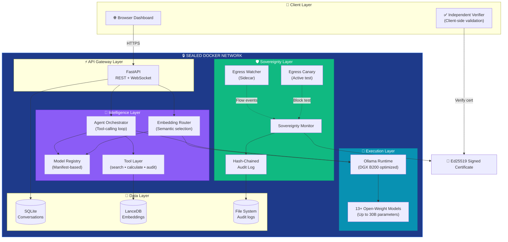

### Data Flow: Chat with Routing and Retrieval

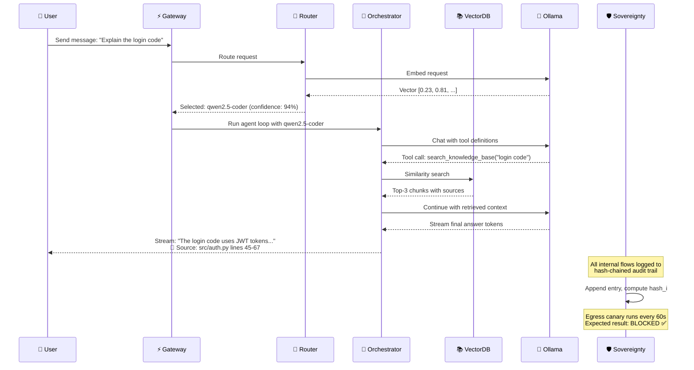

### Sovereignty Attestation Flow

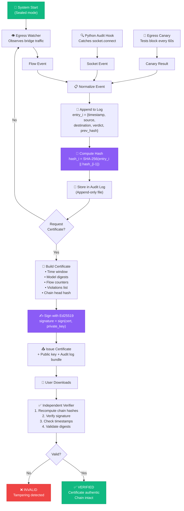

---

## 11. 🧩 Component-Level Architecture

### Core Components

| Component | Responsibilities | Key Interfaces | State |
|-----------|------------------|----------------|-------|
| **🎨 Chat Interface** | Render messages, handle input, stream responses, syntax highlighting | `sendMessage()`, `displayStream()` | `messages[]`, `isStreaming`, `currentModel` |
| **⚡ API Gateway** | REST endpoints, WebSocket handling, authentication, rate limiting | `/chat`, `/models/*`, `/sovereignty/*`, `/documents/*` | Connection pool, auth tokens |
| **🎯 Embedding Router** | Embed query, compare with prototypes, rank models, select best | `route(query) → {model, intent, confidence}` | Intent prototypes cache |
| **📋 Model Registry** | Scan manifests, index by capability, hot-reload, provide metadata | `list()`, `find(capability)`, `getMetadata(name)` | Manifest cache, capability index |
| **🧠 Agent Orchestrator** | Run tool-calling loop, validate arguments, enforce iteration limit | `run(session, message) → response` | Context window, iteration count |
| **🛠️ Tool Layer** | `search_knowledge_base`, `calculate`, `query_audit_log`, `final_answer` | JSON-schema tool definitions | Tool execution history |
| **📚 RAG Engine** | Parse documents, chunk, embed, store, retrieve with citations | `ingest(file)`, `retrieve(query, k)` | Document index, chunk embeddings |
| **🛡️ Sovereignty Monitor** | Aggregate events, maintain chain, generate certificates, compute verdict | `/status`, `/certificate`, `/audit-log` | Chain state, flow counters |
| **👁️ Egress Watcher** | Observe bridge traffic, classify flows, report to monitor | Flow events stream | Packet buffer |
| **🚨 Egress Canary** | Attempt external connection, expect BLOCKED | Periodic test result | Last test timestamp, status |
| **🤖 Ollama Manager** | List models, pull, delete, health check, auto-register | `/api/tags`, `/api/pull`, `/api/generate` | Installed model list |
| **💾 Data Stores** | SQLite (conversations, users), LanceDB (vectors), File system (logs) | SQL queries, vector search, file I/O | Database connections |

### Sovereignty Monitor Deep Dive 🔐

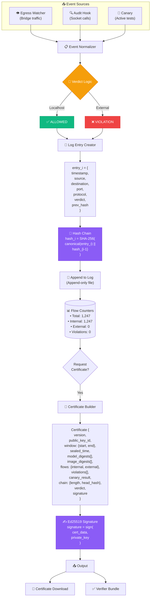

---

## 12. 🔄 Data / Information Flow

### Complete Request-to-Response Flow

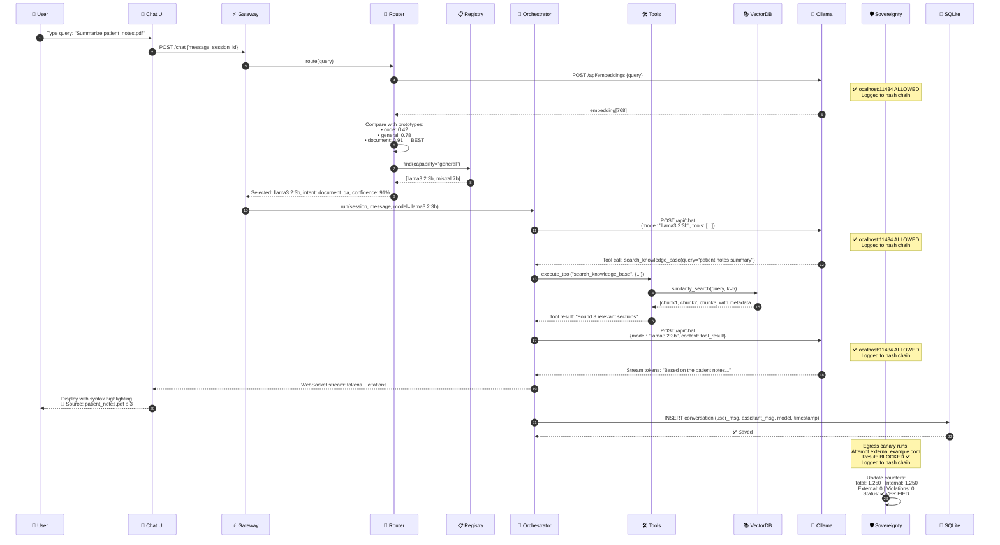

### Model Download Flow (Setup Mode)

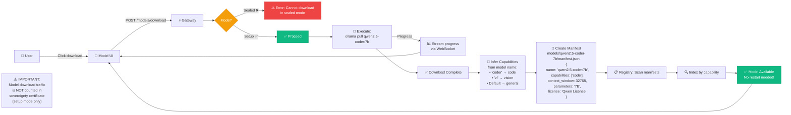

---

## 13. 🤖 Agentic Workflow

### Agent Execution Loop

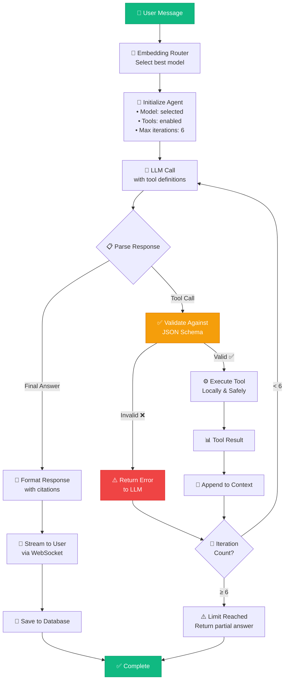

### Available Agent Tools

| Tool | Input Schema | Output | Purpose | Safeguards |
|------|--------------|--------|---------|------------|
| **🔍 search_knowledge_base** | `{query: string, filter?: string}` | `{chunks: [{text, source, score}]}` | Ground answers in uploaded documents | Local vector search only |
| **🧮 calculate** | `{expression: string}` | `{result: number}` | Exact arithmetic (no LLM hallucination) | Safe evaluator, no `eval()` |
| **📊 query_audit_log** | `{time_range?: {start, end}, last_n?: number}` | `{entries: [...], summary: {...}}` | Agent can report on its own network behavior | Read-only access |
| **✅ final_answer** | `{text: string, citations?: [...]}` | Rendered response | Terminate reasoning loop | Mandatory to exit loop |

### Example: Multi-Step Reasoning

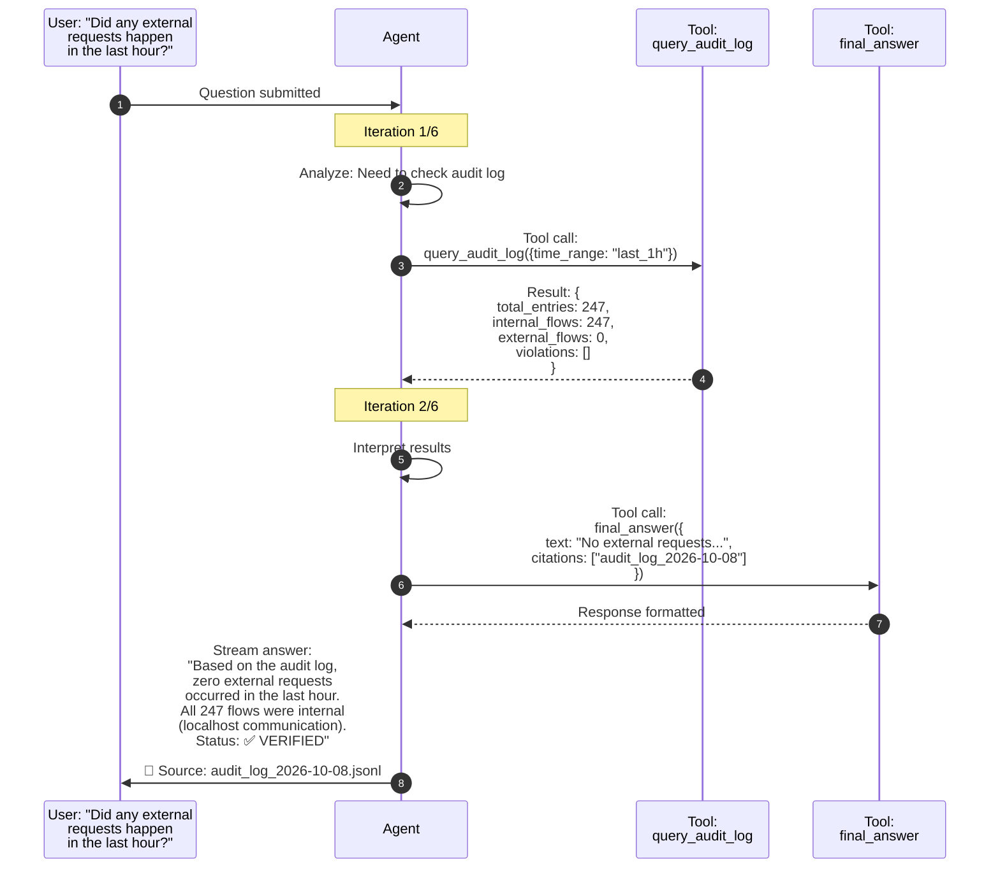

---

## 14. 📚 Technology Stack

### Backend Stack 🔧

| Category | Technology | Version | License |
|----------|-----------|---------|---------|
| **Runtime** | Python | 3.11+ | PSF |
| **API Framework** | FastAPI | 0.100+ | MIT |
| **ASGI Server** | Uvicorn | 0.23+ | BSD-3 |
| **Realtime** | WebSocket (FastAPI) | Built-in | MIT |
| **Database** | SQLite | 3.x | Public Domain |
| **ORM** | SQLAlchemy | 2.0+ | MIT |
| **Vector Store** | LanceDB | Latest | Apache 2.0 |
| **Cryptography** | `cryptography` library | 41+ | Apache 2.0 / BSD |
| **Document Parsing** | pypdf, python-magic | Latest | BSD / MIT |

### AI/ML Stack 🧠

| Component | Technology | Purpose | License |
|-----------|-----------|---------|---------|
| **LLM Runtime** | Ollama | Local inference | MIT |
| **General Models** | llama3.2, mistral, gemma2 | Reasoning, conversation | Varies |
| **Code Models** | qwen2.5-coder, deepseek-coder, codellama | Code generation | Varies |
| **Vision Models** | llava, qwen2.5vl | Image understanding | Apache 2.0, Qwen |
| **Reasoning** | phi3 | Logic, math | MIT |
| **Embeddings** | nomic-embed-text | Semantic search | Apache 2.0 |
| **Large Models** | llama3.1-70b, qwen2.5-32b, mixtral-8x7b | DGX B200 deployment | Varies |

### Frontend Stack 🎨

| Technology | Purpose | License |
|-----------|---------|---------|
| HTMX | Reactive UI without heavy JS | BSD-2 |
| Minimal JavaScript | Charts, WebSocket handling | Custom |
| TailwindCSS (optional) | Styling | MIT |

### Infrastructure Stack 🏗️

| Component | Technology | Purpose | License |
|-----------|-----------|---------|---------|
| **Containerization** | Docker Engine | Application isolation | Apache 2.0 |
| **Orchestration** | Docker Compose | Multi-container setup | Apache 2.0 |
| **Network Isolation** | Docker internal network | Zero-egress enforcement | Apache 2.0 |
| **Egress Monitoring** | tcpdump / libpcap | Traffic observation | BSD-3 |

### Hardware Configurations 💻

**Development Configuration** 🖥️
- CPU: 8+ cores
- RAM: 16GB minimum, 32GB recommended
- Storage: 100GB for models and data
- GPU: Optional (CPU inference supported)

**Production Configuration: NVIDIA DGX B200** 🚀💪
- GPU: NVIDIA Blackwell B200 architecture
- VRAM: Up to 192GB per GPU
- Model Support: Up to 30B parameter models with full precision
- Throughput: High concurrent inference
- CUDA: 12+ optimized
- Deployment: Docker on Ubuntu 22.04 LTS

---

## 15. ✨ Expected Features

### P0: Must Work at Final (Core Demo) 🎯

| Feature | Description | Success Criteria |
|---------|-------------|------------------|
| **🔒 Sealed Mode** | Docker network with zero internet access | Egress canary reports BLOCKED |
| **🔄 Setup Mode** | Internet allowed for model downloads | Models pull successfully |
| **🤖 Multi-Model Chat** | Streaming responses from multiple models | 2+ models respond correctly |
| **🎯 Intelligent Routing** | Embedding-based model selection | Router logs show confidence scores |
| **🛡️ Sovereignty Monitor** | Hash-chained audit log + Ed25519 certificates | Certificate downloads and validates |
| **✅ Independent Verifier** | Browser-side certificate validation | Verifier recomputes and confirms |
| **📊 Live Dashboard** | Real-time VERIFIED/VIOLATED banner | Status updates on every request |
| **🚨 Red-Team Demo** | External request attempted and blocked | Verdict flips to VIOLATED |
| **🔗 Tamper Detection** | Edit audit log and verify failure | Verifier detects broken hash chain |

### P1: Should Work (High Priority) 🥈

| Feature | Description | Value |
|---------|-------------|-------|
| **📄 Document Upload** | PDF/TXT/MD ingestion | RAG over private files |
| **🔍 RAG with Citations** | Cited answers from documents | Source transparency |
| **🛠️ Agent Tools** | search_knowledge_base, calculate, query_audit_log | Multi-step reasoning |
| **📋 Model Manifests** | JSON-based model registration | Hot-reload, no restart |
| **📥 Certificate Download** | Signed sovereignty certificate bundle | Compliance evidence |
| **📊 Flow Table** | Live view of all network flows | Operational transparency |

### P2: If Time Permits (Nice to Have) 🌟

| Feature | Description | Benefit |
|---------|-------------|---------|
| **⚖️ Side-by-Side Comparison** | Same prompt to multiple models | Compare outputs |
| **📈 Audit Export** | CSV/JSON export of full log | External analysis |
| **⚠️ License Display** | Show model licenses in UI | Legal compliance |
| **📱 Mobile Responsive** | Dashboard works on mobile | Accessibility |
| **🎨 Dark Mode** | UI theme toggle | User preference |

---

## 16. 🛠️ Implementation Approach

### One-Day Final Hackathon Schedule ⏱️

**Principles:**
- Build trust layer before features
- Each phase is independently demonstrable
- Drop P2/P1 if needed, but P0 must work
- Pre-pull models before event
- Develop with small models, demo with larger

| Phase | Duration | Work | Deliverable | Fallback |
|-------|----------|------|-------------|----------|
| **Phase 1: Isolation Core** 🔒 | 2 hours | Docker Compose (setup/sealed profiles), internal network, Ollama container, egress canary | Sealed stack + canary reporting BLOCKED | Pre-recorded demo |
| **Phase 2: Evidence** ✅ | 2 hours | Hash-chained audit log, Ed25519 signing, certificate generation, browser verifier | Downloadable certificate that validates | Show certificate without verifier |
| **Phase 3: Intelligence** 🧠 | 2 hours | Model registry with manifests, embedding router, streaming chat API | Requests routed across 2+ models | Single model fallback |
| **Phase 4: Dashboard** 🎨 | 2 hours | Web UI (chat, sovereignty banner, flow table, certificate download) | End-to-end user demo flow | REST-only, no WebSocket |
| **Phase 5: RAG & Agent** 📚 | 3 hours | Document ingestion, vector search, tool-calling loop, query_audit_log tool | Cited answers over private documents | Chat without RAG |
| **Phase 6: Polish** ✨ | 2 hours | Red-team demo script, rehearsal, model pinning, final testing | Stable, rehearsed 6-minute demo | Phase 4 demo only |

**Total:** 13 hours (realistic for hackathon day with buffer)

### Development Strategy 📋

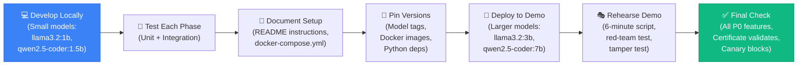

### Risk Mitigation

| Risk | Probability | Impact | Mitigation |
|------|------------|--------|------------|
| **Time pressure** | High | High | P0/P1/P2 prioritization, phases are droppable |
| **Docker networking issues** | Medium | High | Pre-test sealed network, fallback to manual iptables |
| **Model download time** | Medium | Medium | Pre-pull models before event |
| **Egress watcher on Docker Desktop** | Medium | Low | Canary + audit hook sufficient without watcher |
| **Large model OOM** | Low | Medium | Develop with small models, scale up only for demo |
| **WebSocket complexity** | Medium | Low | Build REST first, WebSocket as enhancement |

---

## 17. 🎁 Expected Final Output

### Repository Deliverables 📦

```
VaultLLM/
├── README.md (this file - complete specification)
├── LICENSE (MIT or Apache 2.0)
├── docker-compose.yml (setup & sealed profiles)
├── .env.example (configuration template)
├── backend/
│   ├── main.py (FastAPI application)
│   ├── routers/ (API endpoints)
│   ├── services/ (orchestrator, router, sovereignty)
│   ├── models/ (SQLAlchemy models)
│   └── requirements.txt
├── frontend/ (HTMX + minimal JS)
├── manifests/ (model JSON manifests)
├── verifier/ (browser-based certificate validator)
├── scripts/
│   ├── setup.sh (pull models, generate keys)
│   ├── seal.sh (switch to sealed mode)
│   └── red-team-test.sh (demo external request)
└── docs/
    ├── ARCHITECTURE.md
    ├── THREAT_MODEL.md
    └── API.md
```

### One-Command Start 🚀

```bash
# Setup mode (pull models)
docker compose --profile setup up

# Sealed mode (zero internet)
docker compose --profile sealed up
```

### Six-Minute Demo Script 🎬

```mermaid
gantt
    title VaultLLM Demo Timeline (6 minutes)
    dateFormat  ss
    axisFormat  %S sec
    
    section Problem
    Privacy crisis in AI           :a1, 00, 30s
    
    section Sealed Chat
    Upload document                :a2, 30, 15s
    Ask questions                  :a3, 45, 30s
    Show routing decisions         :a4, 75, 15s
    Display cited answers          :a5, 90, 30s
    
    section Certificate
    Download certificate           :a6, 120, 20s
    Open verifier                  :a7, 140, 20s
    Show VERIFIED status           :a8, 160, 20s
    
    section Red Team
    Run external request           :a9, 180, 30s
    Show blocked + logged          :a10, 210, 30s
    Banner flips to VIOLATED       :a11, 240, 30s
    
    section Tamper Test
    Edit one log line              :a12, 270, 20s
    Re-verify certificate          :a13, 290, 20s
    Verifier detects broken chain  :a14, 310, 20s
    
    section Self Inspection
    Ask agent about network        :a15, 330, 30s
```

**Demo Script Details:**

1. **Problem (30s)** 👋
   - "Local AI is unverifiable. VaultLLM provides cryptographic proof."

2. **Sealed Chat (90s)** 💬
   - Upload `sensitive_contract.pdf`
   - Ask: "What are the key terms in this contract?"
   - Show: Router selected `llama3.2:3b` (confidence: 89%)
   - Display: Cited answer with source references

3. **Certificate (60s)** 📜
   - Click "Download Sovereignty Certificate"
   - Open verifier page
   - Status: ✅ VERIFIED, 0 external flows, chain intact

4. **Red-Team Moment (90s)** 🚨
   - Run: `./scripts/red-team-test.sh` (attempts external API call)
   - Show: Request BLOCKED in real-time
   - Show: Event added to audit log
   - Show: Dashboard banner flips to ❌ VIOLATED

5. **Tamper Test (60s)** 🔍
   - Open audit log file
   - Edit one destination: `localhost` → `evil.com`
   - Refresh verifier
   - Result: ❌ "Hash chain broken at entry 1,243"

6. **Self-Inspection (30s)** 🤖
   - Ask agent: "Did anything leave this machine in the last 5 minutes?"
   - Agent calls `query_audit_log` tool
   - Answer: "Yes, one external request attempt at [timestamp] to api.openai.com was BLOCKED. All other flows were internal. Status: VERIFIED."

---

## 18. 🚀 Future Scope / Scalability

### Near-Term Enhancements (1-3 months) 📅

| Enhancement | Value | Complexity |
|-------------|-------|------------|
| **Hardware Attestation** 🔐 | Bind signing key to TPM/secure enclave | High |
| **Multi-Node Deployment** 🌐 | Distributed Ollama cluster | Medium |
| **Speech I/O** 🎤 | Whisper for transcription, TTS for output | Medium |
| **Vision Models** 👁️ | Full multimodal support (images, diagrams) | Low |
| **Mobile App** 📱 | iOS/Android with offline sync | High |
| **Enterprise SSO** 🏢 | SAML, OAuth, LDAP integration | Medium |

### Mid-Term Scaling (6-12 months) 📈

**Distributed Architecture** 🌐
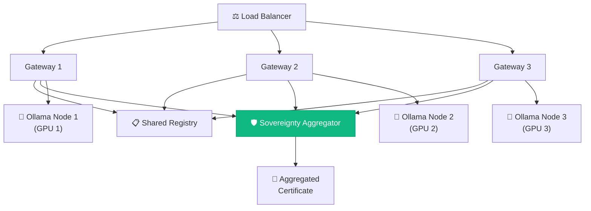

**Enterprise Features** 🏢
- Role-based access control (admin, power user, viewer)
- Usage analytics and cost tracking
- Scheduled compliance reports
- API access for programmatic integration
- Retention policies and data lifecycle management

### Long-Term Vision (1-2 years) 🔮

**Confidential Computing Integration** 🔐
- Deploy in AMD SEV or Intel TDX enclaves
- Remote attestation with hardware roots of trust
- Encrypted memory and sealed model execution

**Model Governance Framework** ⚖️
- License verification and allow-lists
- Signed model manifests from trusted sources
- Automated digest validation
- Community-contributed model repository

**AI Agent Marketplace** 🏪
- Domain-specific tool packs (legal, medical, financial)
- Community-contributed skills and agents
- Verified agent templates
- One-click deployment

**Federated Learning** 🔗
- Multiple organizations collaborate without data sharing
- Privacy-preserving model fine-tuning
- Sovereignty maintained across all nodes

### Scalability Principle 📐

**Core invariant:** New models, tools, nodes, and modalities plug in through manifests and interfaces. The sovereignty layer remains unchanged regardless of scale.

---

## 19. 📜 Open-Source Dependencies / Components

### Complete Dependency Inventory

| Component | Purpose | Version | License | Notes |
|-----------|---------|---------|---------|-------|
| **Ollama** | LLM runtime | Latest | MIT | Model inference and management |
| **Python** | Backend language | 3.11+ | PSF | Application runtime |
| **FastAPI** | Web framework | 0.100+ | MIT | REST + WebSocket API |
| **Uvicorn** | ASGI server | 0.23+ | BSD-3 | Production server |
| **SQLAlchemy** | ORM | 2.0+ | MIT | Database abstraction |
| **SQLite** | Database | 3.x | Public Domain | Application data |
| **LanceDB** | Vector store | Latest | Apache 2.0 | Embeddings and similarity search |
| **cryptography** | Crypto library | 41+ | Apache 2.0 / BSD | Ed25519 signatures, SHA-256 |
| **pypdf** | PDF parsing | Latest | BSD-3 | Document text extraction |
| **python-magic** | File type detection | Latest | MIT | Content type identification |
| **Docker** | Containerization | 24+ | Apache 2.0 | Application isolation |
| **Docker Compose** | Orchestration | 2.20+ | Apache 2.0 | Multi-container management |
| **tcpdump / libpcap** | Packet capture | Latest | BSD-3-Clause | Egress monitoring |
| **HTMX** | Frontend | 1.9+ | BSD-2-Clause | Reactive UI |

### Open-Weight Language Models

| Model | Parameters | Purpose | License | Commercial Use |
|-------|------------|---------|---------|----------------|
| llama3.2 | 1B, 3B | General chat | Meta Llama License | ✅ Allowed |
| mistral | 7B | Multilingual | Apache 2.0 | ✅ Allowed |
| gemma2 | 2B | Fast inference | Gemma Terms | ✅ Allowed |
| qwen2.5-coder | 1.5B, 7B | Code generation | Qwen License | ✅ Allowed |
| deepseek-coder | 6.7B | Code specialist | DeepSeek License | ✅ Allowed |
| codellama | 7B | Code tasks | Meta Llama License | ✅ Allowed |
| llava | 7B | Vision + language | Apache 2.0 | ✅ Allowed |
| qwen2.5vl | 3B, 7B | Multimodal | Qwen License | ✅ Allowed |
| phi3 | 3.8B | Reasoning | MIT | ✅ Allowed |
| nomic-embed-text | 137M | Embeddings | Apache 2.0 | ✅ Allowed |
| llama3.1 | 70B | Large reasoning (DGX B200) | Meta Llama License | ✅ Allowed |
| qwen2.5 | 32B | Large general (DGX B200) | Qwen License | ✅ Allowed |
| mixtral | 8x7B | Mixture of experts (DGX B200) | Apache 2.0 | ✅ Allowed |

**License Note:** Application code will be released under MIT or Apache 2.0. Model licenses vary; VaultLLM records each model's license in its manifest and displays it to users.

### Attribution and Compliance ✅

- Full attribution in `ACKNOWLEDGMENTS.md`
- Model credits in UI "About" page
- Dependency licenses in `LICENSES/` directory
- Community contributions in `CONTRIBUTORS.md`

---

## 20. ⚠️ Expected Challenges and Mitigation Strategies

### Challenge 1: Honest Scope of "Proof" 🎯

**Challenge:** Risk of overclaiming what a signed log actually proves.

**Threat Model (Explicit):**

| In Scope (Detected or Prevented) ✅ | Out of Scope (Stated Explicitly) ❌ |
|-----------------------------------|-----------------------------------|
| Dependencies opening outbound connections in sealed mode | Malicious host administrator rewriting log AND key |
| Model runtime reaching the internet | Physical side channels (EM, power analysis) |
| Past log entries being tampered with | Data leakage via user manually copying output |
| Model file substitution (digests recorded) | Attacks on user's browser or display |
| Certificate forgery (signature verification) | Covert timing channels |

**Mitigation:**
- State threat model explicitly in documentation
- Certificate includes clear scope statement
- Verifier shows "This certificate attests to observed network behavior of the sealed stack"
- Do NOT claim protection against malicious system administrator

**Risk Level:** Medium - Mitigated through transparency

---

### Challenge 2: Egress Observation on Docker Desktop 🖥️

**Challenge:** Docker Desktop (Windows/Mac) hides bridge interface, making sidecar observation difficult.

**Mitigation Strategy:**
1. **Primary enforcement:** Docker internal network (no route configured) + egress canary
2. **Audit hook:** Python socket monitoring catches in-process attempts
3. **Sidecar watcher:** Used where available (Linux, or Docker Desktop with host network mode)
4. **Demo on Linux:** Final presentation on Linux system where full stack works
5. **Documentation:** Clearly state platform requirements

**Fallback:** System still provides strong guarantees without sidecar (network + canary + hook = triple-layer defense)

**Risk Level:** Low - Multiple redundant protections

---

### Challenge 3: Model Downloads vs Air-Gap 🌐

**Challenge:** Setup mode requires internet for model downloads, potentially tainting sovereignty claims.

**Mitigation Strategy:**
1. **Explicit modes:** Setup (internet allowed) vs Sealed (zero internet)
2. **Mode tracking:** Every mode change logged to audit trail
3. **Certificate windows:** Only counts time in sealed mode
4. **Pre-event downloads:** Models pulled before hackathon demo
5. **Audit clarity:** Certificate explicitly shows "Sealed time: 8 hours" vs "Setup time: 15 minutes"

**Documentation:**
```
⚠️ IMPORTANT:
Setup mode traffic is NOT included in 
sovereignty certificates. Only sealed 
mode time counts as verified.
```

**Risk Level:** Low - Mitigated through explicit tracking

---

### Challenge 4: Limited Hardware Resources 💻

**Challenge:** Large models (30B+) may not fit on development machines.

**Mitigation Strategy:**

| Environment | Models | Parameters | Hardware |
|-------------|--------|------------|----------|
| **Development** | llama3.2:1b, qwen2.5-coder:1.5b | 1-1.5B | Laptop (16GB RAM) |
| **Testing** | llama3.2:3b, qwen2.5-coder:7b | 3-7B | Desktop (32GB RAM) |
| **Demo** | mistral:7b, qwen2.5-coder:7b, llama3.1:70b | 7-70B | DGX B200 |

**Architecture benefits:**
- Router and registry are model-size agnostic
- Same code works for 1B and 70B models
- Sovereignty layer unchanged regardless of model size

**Risk Level:** Low - Develop small, demo large

---

### Challenge 5: Streaming + Agent State Complexity 📡

**Challenge:** Tool-calling loops plus WebSocket streaming adds implementation complexity.

**Mitigation Strategy:**
1. **Phase 3:** Build non-streaming REST chat first
2. **Phase 4:** Add WebSocket streaming after REST works
3. **Phase 5:** Add agent tools to streaming
4. **Fallback:** Server-sent events (SSE) if WebSocket proves difficult
5. **State management:** Use async queues to decouple LLM generation from WebSocket transmission

**Risk Level:** Medium - Mitigated through incremental implementation

---

### Challenge 6: Routing Quality for Ambiguous Queries 🎯

**Challenge:** Embedding router may select wrong model for edge cases.

**Mitigation Strategy:**
1. **Confidence threshold:** If confidence < 70%, fall back to general model
2. **User visibility:** Show routing decision in UI ("Selected: qwen2.5-coder, confidence: 94%")
3. **Manual override:** Allow user to select model if desired
4. **Intent prototypes:** Carefully chosen examples representing each category
5. **Evaluation:** Test set of 100 queries with expected model labels

**Example Handling:**
```
Query: "tidy this function"
→ Embed
→ Compare: code=0.68, general=0.42
→ Confidence below 70% threshold
→ Fallback: Use general model
→ Show: "⚠️ Ambiguous request, using llama3.2"
```

**Risk Level:** Low - Graceful degradation with transparency

---

### Challenge 7: Time Pressure During Hackathon ⏰

**Challenge:** Too many features for one-day implementation.

**Mitigation Strategy:**

**P0 Features (Must Have):** 🎯
- Sealed network + canary = 2 hours
- Hash-chained log + certificate = 2 hours
- Chat + routing = 2 hours
- Dashboard = 2 hours
- **Total:** 8 hours (achievable)

**P1 Features (Should Have):** 🥈
- RAG + documents = 2 hours
- Agent tools = 1 hour
- Verifier page = 1 hour
- **Total:** 4 hours (if time allows)

**P2 Features (Nice to Have):** 🌟
- Drop if needed

**Ultimate Fallback:** Pre-recorded demo video

**Risk Level:** Medium - Mitigated through strict prioritization

---

### Contingency Plan Summary 📝

**If behind schedule at hour 8:**
- ✅ Keep: P0 features (sealed mode, certificate, basic chat)
- ⚠️ Drop: P1 (RAG, agent tools)
- ❌ Skip: P2 (all nice-to-haves)

**If behind schedule at hour 10:**
- ✅ Keep: Sealed mode + certificate + single model chat
- ❌ Drop: Router, agent, RAG

**If critical failure:**
- Show pre-recorded demo
- Walk through code and architecture
- Demonstrate certificate verification manually

---

## 🎯 Success Metrics

### Demo Success Criteria

| Metric | Target | Measurement |
|--------|--------|-------------|
| **Sealed mode works** | ✅ Yes | Canary reports BLOCKED |
| **Certificate validates** | ✅ Yes | Verifier shows green checkmark |
| **Red-team test** | ✅ Yes | External request caught and logged |
| **Tamper detection** | ✅ Yes | Verifier catches edited log |
| **Multi-model routing** | 2+ models | Router logs show different selections |
| **Demo timing** | ≤ 7 minutes | Rehearsed and timed |
| **Zero crashes** | ✅ Yes | Stable for full demo |

### Hackathon Judging Criteria Alignment

| Criterion | How VaultLLM Delivers |
|-----------|----------------------|
| **Innovation** 🚀 | Hash-chained logs + Ed25519 signatures + egress canary = novel approach to verifiable privacy |
| **Technical Depth** 💡 | Multi-layer isolation, cryptographic proofs, agent orchestration, semantic routing |
| **Completeness** ✅ | End-to-end working system: UI, backend, isolation, attestation, verification |
| **Open Source** 📜 | 100% open-source stack, MIT/Apache 2.0 license, all dependencies listed |
| **Real-World Impact** 🌍 | Healthcare, legal, finance, government - concrete GDPR/HIPAA compliance use cases |
| **Demo Quality** 🎬 | 6-minute scripted demo with red-team test and live verification |

---

## 📞 Technical Contact

**Repository:** https://github.com/GURU-2006-PRO/VaultLLM 🔗  
**License:** MIT or Apache 2.0 (TBD)  
**Documentation:** Full architecture and API docs in `docs/`  

---

## ✅ Submission Compliance Checklist

- [x] Repository created with appropriate project name
- [x] README contains all 20 mandatory sections
- [x] Problem statement with real-world examples
- [x] Target users and use cases documented
- [x] Open-source AI technology selections named and justified
- [x] AI's role in system explicitly explained
- [x] System architecture documented with Mermaid diagrams
- [x] Component-level architecture detailed
- [x] Data flow documented with sequence diagrams
- [x] Agentic workflow explained with tool descriptions
- [x] Technology stack completely specified with licenses
- [x] Expected features listed with P0/P1/P2 prioritization
- [x] Implementation approach realistic for hackathon timeline
- [x] Expected final output clearly defined with demo script
- [x] Future scope demonstrates scalability vision
- [x] Open-source dependencies fully documented with licenses
- [x] Challenges identified with concrete mitigation strategies
- [x] Threat model explicitly stated
- [x] Professional formatting with emojis and tables
- [x] Mermaid diagrams render correctly on GitHub
- [x] DGX B200 GPU infrastructure mentioned
- [x] Support for models up to 30B parameters documented

---

**🏆 Qualifier Submission Status: COMPLETE**

This technical proposal demonstrates:
✅ Comprehensive understanding of the privacy verification problem  
✅ Novel cryptographic approach (hash-chained logs + Ed25519 signatures)  
✅ Realistic implementation plan with clear prioritization  
✅ Production-ready architecture (Docker isolation + multi-layer monitoring)  
✅ Enterprise applicability (GDPR/HIPAA compliance evidence)  
✅ Technical depth (semantic routing, agent orchestration, RAG)  
✅ Clear differentiation from existing solutions  
✅ Verifiable claims (independent browser-based validator)  

**Implementation will be completed during the Final Hackathon on October 10, 2026.** 🚀

---

*VaultLLM: Local AI you can verify, not just trust.* 🔐✨
